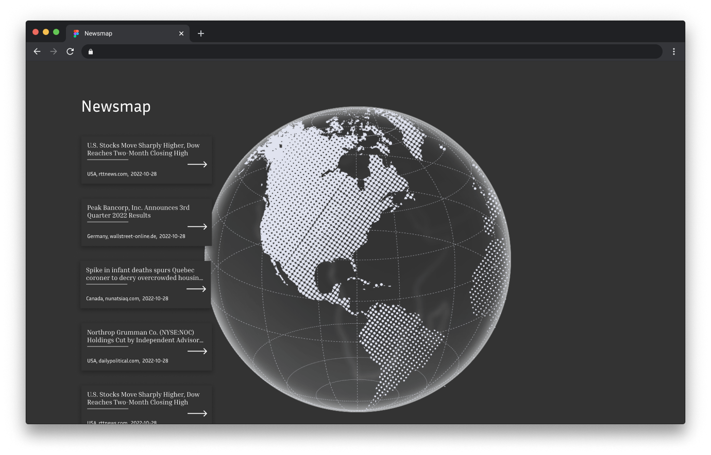
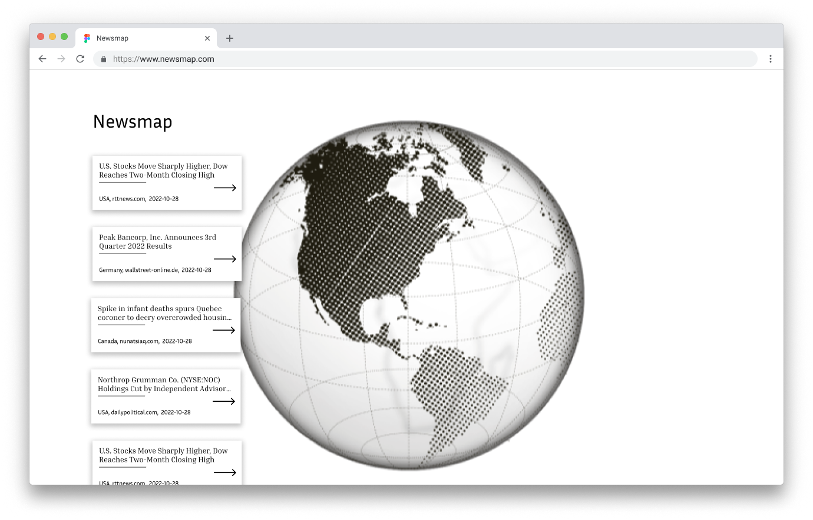
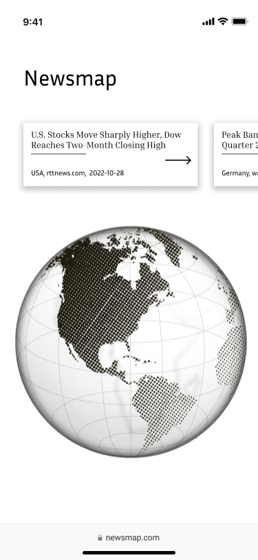
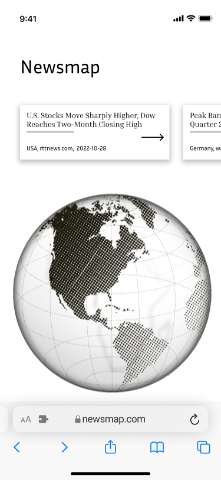
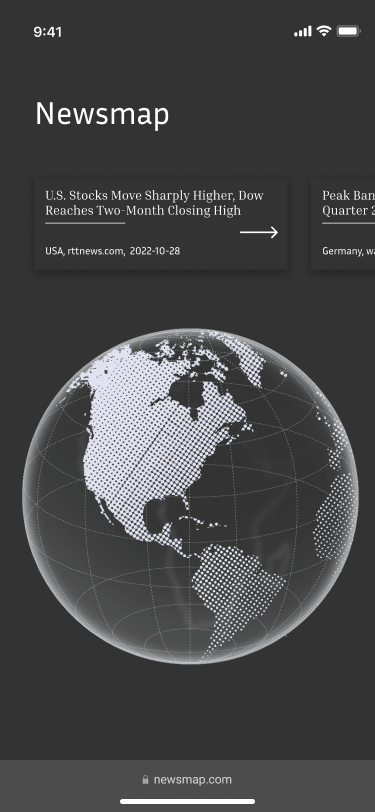
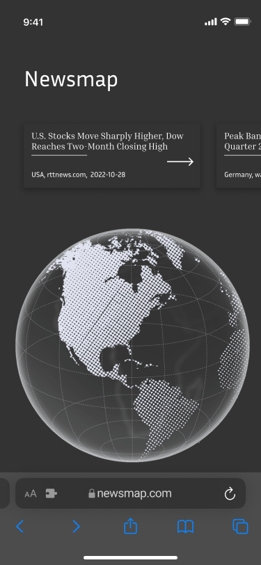

# newsmap.com 📰
We created this App 📱 during the hackathon 🤓 hack.stair.ch 🌐 2️⃣0️⃣2️⃣2️⃣. Our App 📱 includes news 📰 posts from newscatcherapi.com 🌐. 

## Teamname 📍
<br>
<div style=" position: absolute;">
    <h2 style="margin-left:15px; display: inline; vertical-align:middle;"> 
        
        Rolltreppe (Rollstair 😜)
    </h2>
<div>

## Members 🏃🏼🏃🏼🏃🏼
- Dario Erismann
- Ruben Nunez
- Jordan Suter

## Packages 📦 and Tools 🔨 used

```bash
https://reactjs.org/
https://threejs.org/
https://github.com/vasturiano/react-globe.gl

```


## Getting Started 🐳

```bash
docker build -t newsmap .
docker run -dp 3000:80 newsmap
```


## Open Browser 🌐
```bash
https://localhost:3000/
```
    
## Features ✨
    - Globe (Can be rotated with mouse or arrow keys)
    - News are categorized by country
    - Top news are shown in a list
    - Hovering a news item will show it's country
    - Clicking on a news will open the source
    - Clicking on a country will filter the news
    - The filter can be deleted
    - Countries with more news appear bigger on the globe
    - News come from a news API in the backend
    - UI is responsive
    - Can run dockerized


## Clean Concept 📚

### Desktop Light


### Desktop Dark


### Phone Light



### Phone Dark



